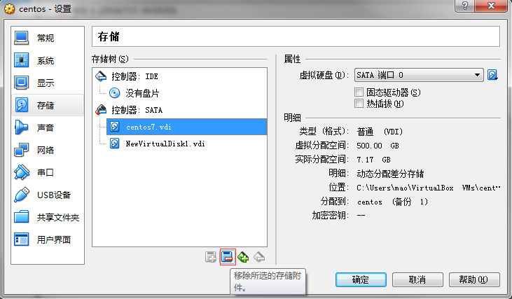
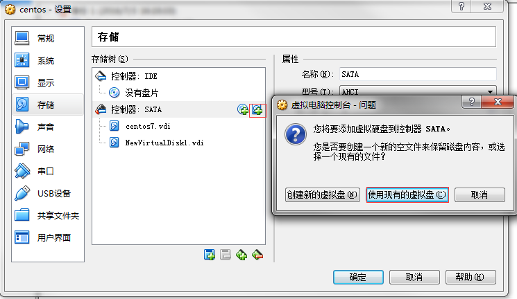
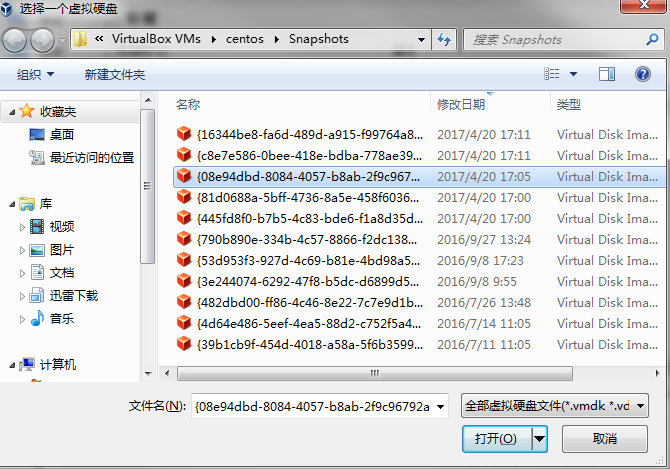

# record my common notes

## some useful docker commands
```shell
#list images with format like 'repository:tag'
docker images --format '{{.Repository}}:{{.Tag}}'
#search images of a certain registry
docker images --format '{{.Repository}}:{{.Tag}}' | grep registryName | sed 's#/# #g' | awk '{print $2}'

```

## ip forward
```shell
#!/bin/bash
pro='tcp'
NAT_Host='192.168.56.105'
NAT_Port=10680
Dst_Host='192.168.56.106'
Dst_Port=80
iptables -t nat -A PREROUTING -p $pro --dport $NAT_Port -j DNAT --to-destination $Dst_Host:$Dst_Port
iptables -t nat -A POSTROUTING -p $pro --dport $Dst_Port -d $Dst_Host -j SNAT --to $NAT_Host
#echo 1 > /proc/sys/net/ipv4/ip_forward
```
## raspberry pi simple gpio example using shell
```shell
#!/bin/bash

echo "5" > /sys/class/gpio/export
echo "out" > /sys/class/gpio/gpio5/direction
echo "1" > /sys/class/gpio/gpio5/value

sleep 1

echo "5" > /sys/class/gpio/unexport
```

## some raspberry pi docker repository
- armbuild: https://hub.docker.com/u/armbuild/
- resin: https://hub.docker.com/u/resin/
- hypriot: https://hub.docker.com/u/hypriot/


-----------------------------------------------------------
# 记录一些异常状况的解决。
## virtualbox 恢复到最近状态。
情况：virtualbox中虚拟机出错，重启后恢复到上次的snapshot状态（snapshot很久之前）。    

解决：关机。查找`VirtualBox VMs\<vmname>\Snapshots]`目录下的.vdi文件，如果有出错之前最新的，在virtualbox界面，点击设置->存储，将当前的.vdi移除，再点击添加虚拟硬盘，选中最新的.vdi文件，添加，没问题的话话启动虚拟机，应该就可以恢复到出错之前的状态，前提是可以找到出错前的.vdi文件。    






